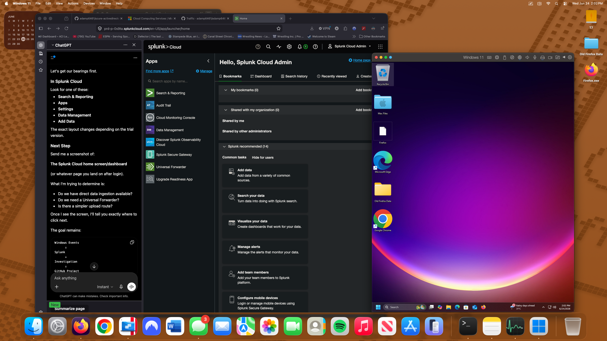
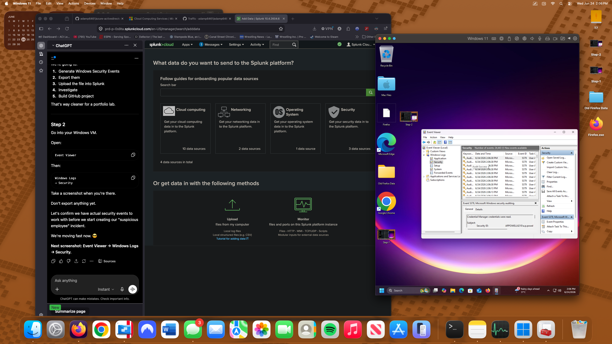
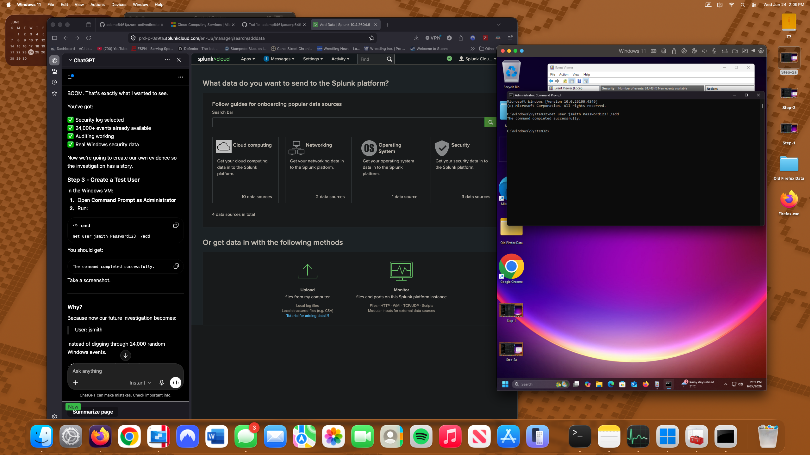
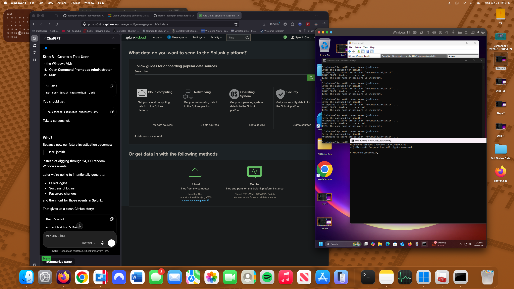
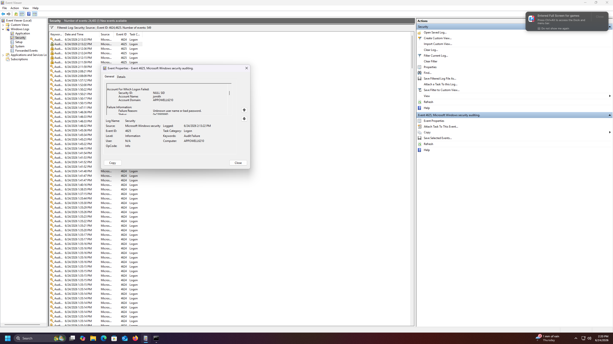
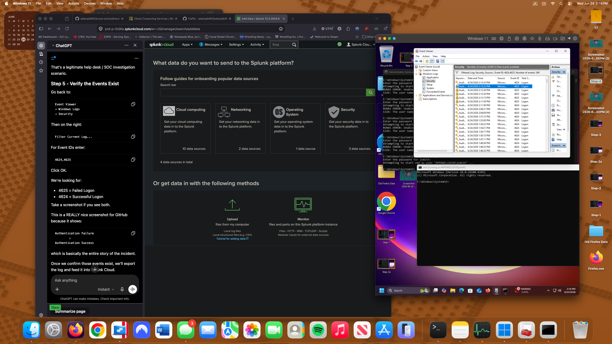
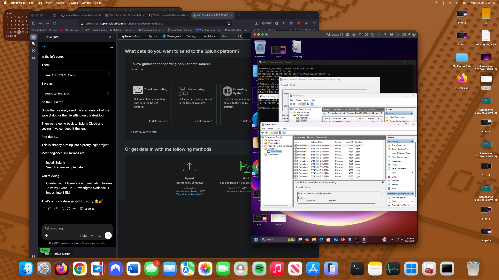
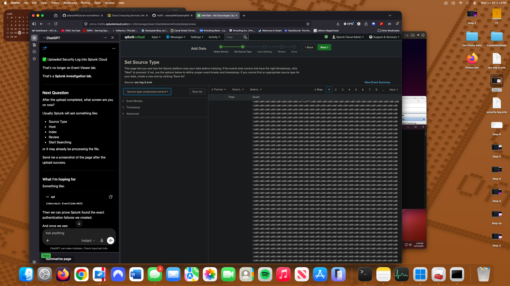
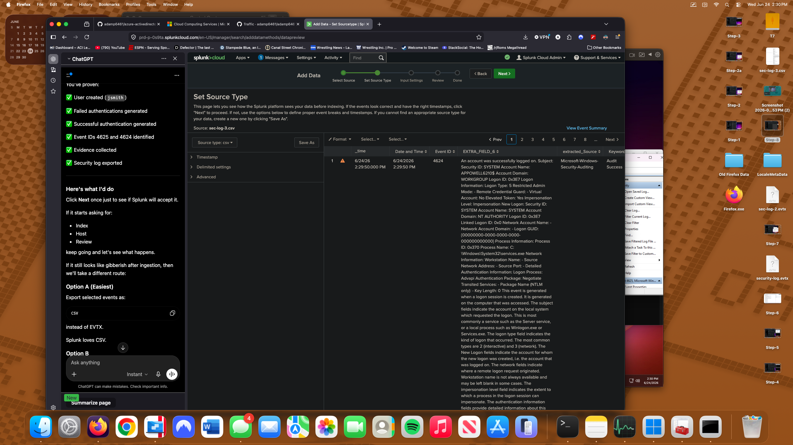
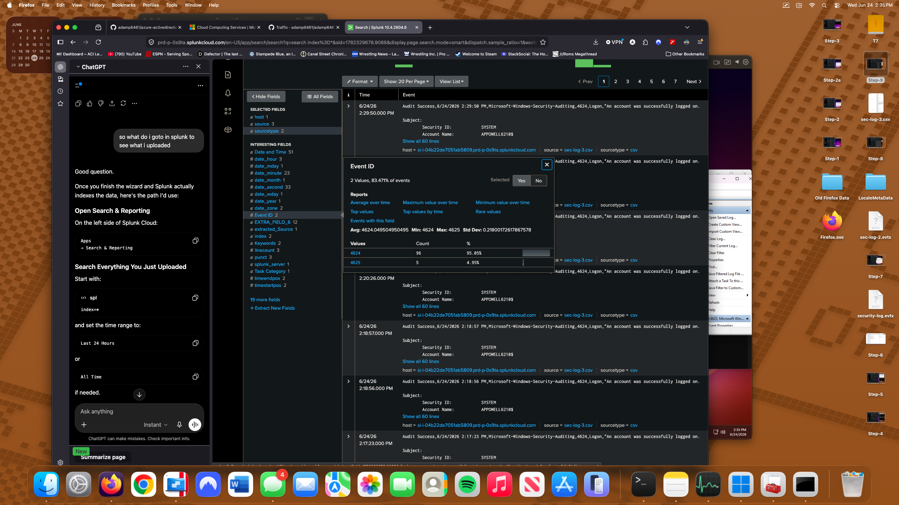

# Splunk Authentication Investigation Lab

## Project Overview

This project demonstrates a basic security investigation workflow using Windows Security Logs and Splunk Cloud.

A test user account was created within a Windows 11 virtual machine to simulate authentication activity. Failed and successful login attempts were generated, collected through Event Viewer, exported from Windows Security Logs, and ingested into Splunk Cloud for analysis.

The goal was to identify authentication events, validate security log collection, and investigate login activity using Event IDs 4624 and 4625.

📄 [Read the full Incident Report](incident-report/final-report.md)
---

## Technologies Used

- Splunk Cloud
- Windows 11
- Windows Event Viewer
- Windows Security Logs
- Command Prompt
- CSV Log Export

---

## Investigation Scenario

A test user account was created to simulate authentication activity within a Windows environment.

The investigation focused on:

- User account creation
- Failed authentication attempts
- Successful authentication events
- Security log collection
- SIEM ingestion and analysis

---

## Investigation Steps

### 1. Splunk Cloud Environment Setup

Accessed Splunk Cloud and prepared the environment for log ingestion.



---

### 2. Windows Security Log Review

Opened Windows Event Viewer and reviewed Security logs to verify auditing was enabled and events were being generated.



---

### 3. Test User Creation

Created a test user account named `jsmith` using Command Prompt.

```cmd
net user jsmith Password123! /add
```



---

### 4. Verification of Security Events

Filtered Windows Security logs to locate authentication-related events.

Event IDs investigated:

- 4624 – Successful Logon
- 4625 – Failed Logon



---

### 5. Failed Authentication Analysis

Identified failed authentication attempts associated with the `jsmith` account.

Failure reason:

```text
Unknown user name or bad password
```



---

### 6. Security Log Export

Exported Windows Security logs for ingestion into Splunk.



---

### 7. CSV Log Preparation

Prepared exported log data for Splunk Cloud ingestion.



---

### 8. Splunk Data Upload

Uploaded Windows Security log data into Splunk Cloud.



---

### 9. Log Parsing and Field Extraction

Verified Splunk successfully parsed authentication events and extracted relevant fields.



---

### 10. Authentication Event Investigation

Analyzed authentication activity within Splunk Cloud.

Findings included:

- Event ID 4624 (Successful Logon)
- Event ID 4625 (Failed Logon)
- Authentication activity associated with user account `jsmith`



---

## Findings

The investigation identified:

- Multiple failed authentication attempts (Event ID 4625)
- Successful authentication events (Event ID 4624)
- Failed logins caused by invalid credentials
- Authentication activity associated with user account `jsmith`

No evidence of privilege escalation or malicious activity was observed.

---

## Key Event IDs

| Event ID | Description |
|-----------|------------|
| 4624 | Successful Logon |
| 4625 | Failed Logon |

---

## Skills Demonstrated

- Security Log Analysis
- Windows Event Viewer
- Authentication Investigation
- Splunk Cloud
- SIEM Fundamentals
- Event Correlation
- Incident Documentation
- Security Monitoring


## MITRE ATT&CK References

The following MITRE ATT&CK techniques were referenced to provide context for the authentication events analyzed during this investigation.

| Technique | ID | Relation to Lab |
|-----------|----|-----------------|
| Brute Force | T1110 | Event ID 4625 (Failed Logon) demonstrates repeated failed authentication attempts. |
| Valid Accounts | T1078 | Event ID 4624 (Successful Logon) demonstrates successful authentication using valid credentials. |
| Create Account | T1136 | A test user account (`jsmith`) was created to generate authentication events for analysis. |

**Note:** All authentication events were intentionally generated within a controlled lab environment for educational and defensive analysis purposes.
---

## Author

Adam Powell

Apple Genius | CompTIA Security+ | Jamf 100 Certified

GitHub: https://github.com/adamp6461
